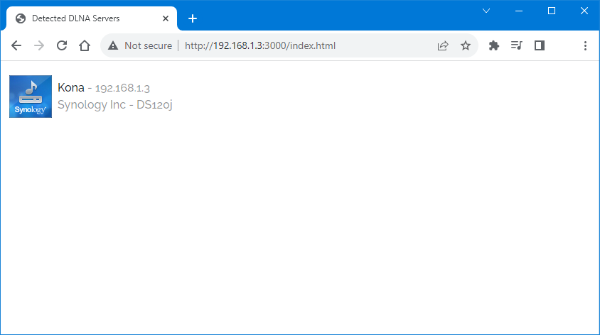
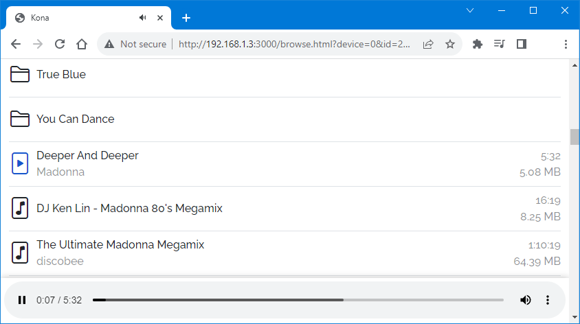

# node-upnp-browser
This is a node web server which searches for UPnP&trade; / DLNA servers and shows the content. You can browse the server and play music files.

The node libraries `node-ssdp` and `node-upnp-control-point` are used for UPnP&trade; / DLNA discovery and browsing.

## http://\<ip\>:3000/index.html
Shows all detected UPnP&trade; / DLNA servers.

## http://\<ip\>:3000/browse.html
Shows the folder content and plays music files.

